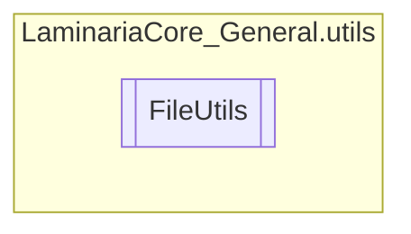

# FileUtils `Public class`

## Description
This class provides a wide variety of methods for quick and easy writing/reading from files.

## Diagram


## Members
### Methods
#### Public Static methods
| Returns | Name |
| --- | --- |
| `void` | [`AppendToFile`](#appendtofile)(`string` path, `string` data)<br>Appends a given line to the end of the file. |
| `void` | [`DumpToFile`](#dumptofile)(`string` path, `List`&lt;`string`&gt; data) |
| `void` | [`DumpToFileBinary`](#dumptofilebinary)(`string` path, `List`&lt;`string`&gt; data) |
| `void` | [`EnsurePath`](#ensurepath)(`string` path, `FileAttributes` pathType)<br>Ensures the existence of the given path, be it a directory or a file. |
| `List`&lt;`string`&gt; | [`ReadFromFile`](#readfromfile)(`string` path)<br>Reads all the lines from a file and returns them in the form of a list. |
| `List`&lt;`string`&gt; | [`ReadFromFileBinary`](#readfromfilebinary)(`string` path)<br>Reads the data in the specified filepath and returns it in the form of a list with<br>            all the values as strings. |

## Details
### Summary
This class provides a wide variety of methods for quick and easy writing/reading from files.

### Methods
#### EnsurePath
[*Source code*](https://github.com///blob//C#/LaminariaCore-General/utils/FileUtils.cs#L26)
```csharp
public static void EnsurePath(string path, FileAttributes pathType)
```
##### Arguments
| Type | Name | Description |
| --- | --- | --- |
| `string` | path | The path to ensure the existence of |
| `FileAttributes` | pathType | Whether the path is a file or directory. If not specified, it will be automatically determined.<br>            This parameter accepts either a FileAttributes.Directory or FileAttributes.Normal type. |

##### Summary
Ensures the existence of the given path, be it a directory or a file.

#### DumpToFile
[*Source code*](https://github.com///blob//C#/LaminariaCore-General/utils/FileUtils.cs#L26)
```csharp
public static void DumpToFile(string path, List<string> data)
```
##### Arguments
| Type | Name | Description |
| --- | --- | --- |
| `string` | path |   |
| `List`&lt;`string`&gt; | data |   |

#### AppendToFile
[*Source code*](https://github.com///blob//C#/LaminariaCore-General/utils/FileUtils.cs#L26)
```csharp
public static void AppendToFile(string path, string data)
```
##### Arguments
| Type | Name | Description |
| --- | --- | --- |
| `string` | path | The filepath to append the data into |
| `string` | data | A string containing the line to write into the file. |

##### Summary
Appends a given line to the end of the file.

#### ReadFromFile
[*Source code*](https://github.com///blob//C#/LaminariaCore-General/utils/FileUtils.cs#L26)
```csharp
public static List<string> ReadFromFile(string path)
```
##### Arguments
| Type | Name | Description |
| --- | --- | --- |
| `string` | path | The filepath to read the data from |

##### Summary
Reads all the lines from a file and returns them in the form of a list.

##### Returns
A list containing all the lines in the file

#### DumpToFileBinary
[*Source code*](https://github.com///blob//C#/LaminariaCore-General/utils/FileUtils.cs#L26)
```csharp
public static void DumpToFileBinary(string path, List<string> data)
```
##### Arguments
| Type | Name | Description |
| --- | --- | --- |
| `string` | path |   |
| `List`&lt;`string`&gt; | data |   |

#### ReadFromFileBinary
[*Source code*](https://github.com///blob//C#/LaminariaCore-General/utils/FileUtils.cs#L26)
```csharp
public static List<string> ReadFromFileBinary(string path)
```
##### Arguments
| Type | Name | Description |
| --- | --- | --- |
| `string` | path | The filepath to read the data from |

##### Summary
Reads the data in the specified filepath and returns it in the form of a list with
            all the values as strings.

##### Returns
The primitive values in a list of strings

*Generated with* [*ModularDoc*](https://github.com/hailstorm75/ModularDoc)
