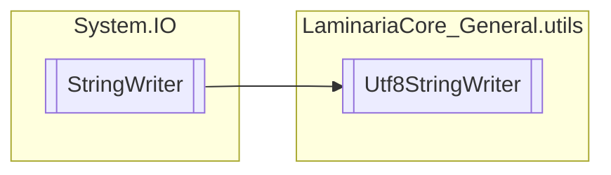

# Utf8StringWriter `Internal class`

## Description
This class extends the functionality of the StringWriter class, defining its
            encoding in utf-8.

## Diagram


## Members
### Properties
#### Public  properties
| Type | Name | Methods |
| --- | --- | --- |
| `Encoding` | [`Encoding`](#encoding) | `get` |

## Details
### Summary
This class extends the functionality of the StringWriter class, defining its
            encoding in utf-8.

### Inheritance
 - `StringWriter`

### Constructors
#### Utf8StringWriter
```csharp
public Utf8StringWriter()
```

### Properties
#### Encoding
```csharp
public override Encoding Encoding { get; }
```

*Generated with* [*ModularDoc*](https://github.com/hailstorm75/ModularDoc)
