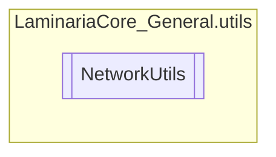

# NetworkUtils `Public class`

## Description
This class contains a bunch of useful methods for interacting with the network

## Diagram


## Members
### Methods
#### Public Static methods
| Returns | Name |
| --- | --- |
| `string` | [`GetExternalIPAddress`](#getexternalipaddress)()<br>Returns the External IPv4 Address. |
| `string` | [`GetLocalIPAddress`](#getlocalipaddress)()<br>Returns the Local IPv4 Address. |
| `int` | [`GetNextAvailablePort`](#getnextavailableport)(`int` startingPort)<br>Determines the next available port based on a given starting port, up<br>            until port 65534. This is done by creating a TCP socket and trying to bind<br>            the port to the local IP Address. |
| `bool` | [`IsWifiConnected`](#iswificonnected)()<br>Checks if the current machine has internet connectivity. |

#### Private Static methods
| Returns | Name |
| --- | --- |
| `bool` | [`PortInUse`](#portinuse)(`int` port)<br>Checks if a port is open or not, by accessing the list of active TCP listeners<br>            and checking if any endpoint has the same port as the one we're checking. |

## Details
### Summary
This class contains a bunch of useful methods for interacting with the network

### Methods
#### GetExternalIPAddress
[*Source code*](https://github.com///blob//C#/LaminariaCore-General/utils/NetworkUtils.cs#L20)
```csharp
public static string GetExternalIPAddress()
```
##### Summary
Returns the External IPv4 Address.

##### Returns
A string containing the ip addr

#### GetLocalIPAddress
[*Source code*](https://github.com///blob//C#/LaminariaCore-General/utils/NetworkUtils.cs#L20)
```csharp
public static string GetLocalIPAddress()
```
##### Summary
Returns the Local IPv4 Address.

##### Returns
A string containing the ip addr

#### GetNextAvailablePort
[*Source code*](https://github.com///blob//C#/LaminariaCore-General/utils/NetworkUtils.cs#L20)
```csharp
public static int GetNextAvailablePort(int startingPort)
```
##### Arguments
| Type | Name | Description |
| --- | --- | --- |
| `int` | startingPort | The port to start the binding checks on |

##### Summary
Determines the next available port based on a given starting port, up
            until port 65534. This is done by creating a TCP socket and trying to bind
            the port to the local IP Address.

##### Returns
Either the starting port or the next available port after it

#### PortInUse
[*Source code*](https://github.com///blob//C#/LaminariaCore-General/utils/NetworkUtils.cs#L20)
```csharp
private static bool PortInUse(int port)
```
##### Arguments
| Type | Name | Description |
| --- | --- | --- |
| `int` | port | The port to check |

##### Summary
Checks if a port is open or not, by accessing the list of active TCP listeners
            and checking if any endpoint has the same port as the one we're checking.

##### Returns
Whether the port is open or not

#### IsWifiConnected
[*Source code*](https://github.com///blob//C#/LaminariaCore-General/utils/NetworkUtils.cs#L20)
```csharp
public static bool IsWifiConnected()
```
##### Summary
Checks if the current machine has internet connectivity.

##### Returns
True if it is, false if not, or an error occured.

*Generated with* [*ModularDoc*](https://github.com/hailstorm75/ModularDoc)
