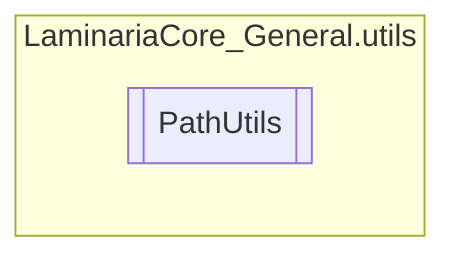

# PathUtils `Public class`

## Description
This class aims to provide a set of utilities to work with paths.

## Diagram


## Members
### Methods
#### Public Static methods
| Returns | Name |
| --- | --- |
| `bool` | [`EqualsPath`](#equalspath)(`string` path, `string` path2)<br>Compares two paths, and returns true if they are equal. |
| `string` | [`NormalizePath`](#normalizepath)(`string` path)<br>Normalizes a path, changing it to a common format.<br>            Every path should be formatted as such.: "path/to/directory" |

## Details
### Summary
This class aims to provide a set of utilities to work with paths.

### Methods
#### NormalizePath
[*Source code*](https://github.com///blob//C#/LaminariaCore-General/utils/PathUtils.cs#L19)
```csharp
public static string NormalizePath(string path)
```
##### Arguments
| Type | Name | Description |
| --- | --- | --- |
| `string` | path | The path to normalize. |

##### Summary
Normalizes a path, changing it to a common format.
            Every path should be formatted as such.: "path/to/directory"

##### Returns
The normalized path.

#### EqualsPath
[*Source code*](https://github.com///blob//C#/LaminariaCore-General/utils/PathUtils.cs#L19)
```csharp
public static bool EqualsPath(string path, string path2)
```
##### Arguments
| Type | Name | Description |
| --- | --- | --- |
| `string` | path | The target path, the one being called through the string |
| `string` | path2 | The target to compare the first path with |

##### Summary
Compares two paths, and returns true if they are equal.

##### Returns
Whether the paths are equal or not

*Generated with* [*ModularDoc*](https://github.com/hailstorm75/ModularDoc)
