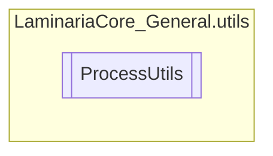

# ProcessUtils `Public class`

## Description
This class implements a bunch of methods to manipulate processes

## Diagram


## Members
### Methods
#### Public Static methods
| Returns | Name |
| --- | --- |
| `Process` | [`CreateProcess`](#createprocess)(`string` java, `string` args, `string` workingDirectory)<br>Creates a Java jar process, redirecting its STDOUT and STDERR to process it. |
| `Process` | [`GetProcessById`](#getprocessbyid)(`int` id)<br>Gets a process object from its ID if it is still running. |
| `void` | [`KillProcessAndChildren`](#killprocessandchildren)(`Process` proc, `int` pid)<br>Kill a process and all of its children immediately. |

## Details
### Summary
This class implements a bunch of methods to manipulate processes

### Methods
#### KillProcessAndChildren
[*Source code*](https://github.com///blob//C#/LaminariaCore-General/utils/ProcessUtils.cs#L26)
```csharp
public static void KillProcessAndChildren(Process proc, int pid)
```
##### Arguments
| Type | Name | Description |
| --- | --- | --- |
| `Process` | proc | The process where this method is being called from |
| `int` | pid | Process ID. |

##### Summary
Kill a process and all of its children immediately.

#### CreateProcess
[*Source code*](https://github.com///blob//C#/LaminariaCore-General/utils/ProcessUtils.cs#L26)
```csharp
public static Process CreateProcess(string java, string args, string workingDirectory)
```
##### Arguments
| Type | Name | Description |
| --- | --- | --- |
| `string` | java | The java version path to run |
| `string` | args | The java args to run the jar with |
| `string` | workingDirectory | The working directory of the process |

##### Summary
Creates a Java jar process, redirecting its STDOUT and STDERR to process it.

##### Returns
The process started

#### GetProcessById
[*Source code*](https://github.com///blob//C#/LaminariaCore-General/utils/ProcessUtils.cs#L26)
```csharp
public static Process GetProcessById(int id)
```
##### Arguments
| Type | Name | Description |
| --- | --- | --- |
| `int` | id | The ID of the process to get |

##### Summary
Gets a process object from its ID if it is still running.

##### Returns
The Process, if it is still running. Else, null

*Generated with* [*ModularDoc*](https://github.com/hailstorm75/ModularDoc)
