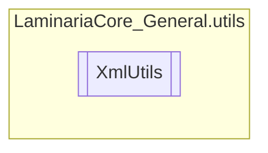

# XmlUtils `Public class`

## Description
This class offers a multitude of useful XML methods that make serializing, creating and
            reading XML easier. The type parameters used in this class need to be of a Serializable.

## Diagram


## Members
### Methods
#### Public Static methods
| Returns | Name |
| --- | --- |
| `T` | [`DeserializeFromFile`](#deserializefromfile)(`string` filepath) |
| `T` | [`DeserializeFromString`](#deserializefromstring)(`string` str) |
| `void` | [`SerializeToFile`](#serializetofile)(`string` filepath, `object` obj) |
| `string` | [`SerializeToString`](#serializetostring)(`object` obj) |

## Details
### Summary
This class offers a multitude of useful XML methods that make serializing, creating and
            reading XML easier. The type parameters used in this class need to be of a Serializable.

### Methods
#### SerializeToString
[*Source code*](https://github.com///blob//C#/LaminariaCore-General/utils/XmlUtils.cs#L34)
```csharp
public static string SerializeToString<T>(object obj)
where T : 
```
##### Arguments
| Type | Name | Description |
| --- | --- | --- |
| `object` | obj |   |

#### SerializeToFile
[*Source code*](https://github.com///blob//C#/LaminariaCore-General/utils/XmlUtils.cs#L34)
```csharp
public static void SerializeToFile<T>(string filepath, object obj)
where T : 
```
##### Arguments
| Type | Name | Description |
| --- | --- | --- |
| `string` | filepath |   |
| `object` | obj |   |

#### DeserializeFromFile
[*Source code*](https://github.com///blob//C#/LaminariaCore-General/utils/XmlUtils.cs#L34)
```csharp
public static T DeserializeFromFile<T>(string filepath)
where T : 
```
##### Arguments
| Type | Name | Description |
| --- | --- | --- |
| `string` | filepath |   |

#### DeserializeFromString
[*Source code*](https://github.com///blob//C#/LaminariaCore-General/utils/XmlUtils.cs#L34)
```csharp
public static T DeserializeFromString<T>(string str)
where T : 
```
##### Arguments
| Type | Name | Description |
| --- | --- | --- |
| `string` | str |   |

*Generated with* [*ModularDoc*](https://github.com/hailstorm75/ModularDoc)
